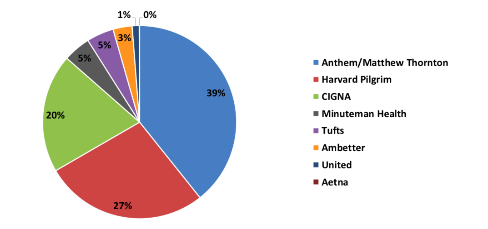

---
output:
  pdf_document:
  number_sections: yes
documentclass: report
geometry: "left=1.5in, right=1in, top=1in, bottom=1in"
fontsize: 12pt
---


```{r child = 'title_page.Rmd'}
```

\newpage
\pagenumbering{arabic}

```{r, include=FALSE}
library(knitr)
library(tidyverse)
library(fs)
library(readxl)
library(janitor)
library(scales)
library(ggthemes)
library(stringi)
```

```{r, include=FALSE}

file_names <- dir_ls("NH_HealthCost_data/")

merge_sheets <- function(x) {
  bind_rows(
    x %>%
      excel_sheets() %>%
      set_names() %>% 
      map(read_excel, path = x), .id = "Insurer")
}

primary_data <- bind_rows(
merge_sheets("NH_HealthCost_data/29881 Arthroscopic Knee Surgery (outpatient).xlsx"),
merge_sheets("NH_HealthCost_data/45378 Diagnostic colonoscopy (outpatient).xlsx"),
merge_sheets("NH_HealthCost_data/45380 Colonoscopy with biopsy (outpatient).xlsx"),
merge_sheets("NH_HealthCost_data/45385 Colonoscopy with polyp removal (outpatient).xlsx"),
merge_sheets("NH_HealthCost_data/51798 Urine Capacity Measurement.xlsx"),
merge_sheets("NH_HealthCost_data/70450 CT - Head&Brain, without dye.xlsx"),
merge_sheets("NH_HealthCost_data/70553 MRI - Brain (outpatient).xlsx"),
merge_sheets("NH_HealthCost_data/71020 X-Ray - Chest (outpatient).xlsx"),
merge_sheets("NH_HealthCost_data/71260 CT - Chest (outpatient).xlsx"),
merge_sheets("NH_HealthCost_data/72040 X-Ray - Neck (Spine, Cervical).xlsx"),
merge_sheets("NH_HealthCost_data/72070 X-Ray - Middle Back (Spine, Thoracic).xlsx"),
merge_sheets("NH_HealthCost_data/72100 X-Ray - Spine (outpatient).xlsx"),
merge_sheets("NH_HealthCost_data/72148 MRI - Back (outpatient).xlsx"),
merge_sheets("NH_HealthCost_data/72170 X-Ray - Pelvis.xlsx"),
merge_sheets("NH_HealthCost_data/72197 MRI - Pelvis (outpatient).xlsx"),
merge_sheets("NH_HealthCost_data/73030 X-Ray - Shoulder (outpatient).xlsx"),
merge_sheets("NH_HealthCost_data/73110 X-Ray - Wrist (outpatient).xlsx"),
merge_sheets("NH_HealthCost_data/73130 X-Ray - Hand.xlsx"),
merge_sheets("NH_HealthCost_data/73221 MRI - Shoulder, Elbow, or Wrist.xlsx"),
merge_sheets("NH_HealthCost_data/73502 X-Ray - Hip.xlsx"),
merge_sheets("NH_HealthCost_data/73562 X-Ray - Knee (outpatient).xlsx"),
merge_sheets("NH_HealthCost_data/73610 X-Ray - Ankle (outpatient).xlsx"),
merge_sheets("NH_HealthCost_data/73630 X-Ray - Foot (outpatient).xlsx"),
merge_sheets("NH_HealthCost_data/73721 MRI - Knee (outpatient).xlsx"),
merge_sheets("NH_HealthCost_data/74000 X-Ray - Abdomen.xlsx"),
merge_sheets("NH_HealthCost_data/74177 CT - Abdomen & Pelvis, with contrast.xlsx"),
merge_sheets("NH_HealthCost_data/76536 Ultrasound - Head and Neck.xlsx"),
merge_sheets("NH_HealthCost_data/76642 Ultrasound - Breast (outpatient).xlsx"),
merge_sheets("NH_HealthCost_data/76700 Ultrasound - Abdominal, Complete.xlsx"),
merge_sheets("NH_HealthCost_data/76705 Ultrasound - Abdominal, Limited.xlsx"),
merge_sheets("NH_HealthCost_data/76805 Ultrasound - Pregnancy (outpatient).xlsx"),
merge_sheets("NH_HealthCost_data/76816 Ultrasound - Pregnancy follow-up.xlsx"),
merge_sheets("NH_HealthCost_data/76830 Ultrasound - Transvaginal (non-maternity).xlsx"),
merge_sheets("NH_HealthCost_data/76856 Ultrasound - Pelvic (outpatient).xlsx"),
merge_sheets("NH_HealthCost_data/77067 Mammogram (outpatient).xlsx"),
merge_sheets("NH_HealthCost_data/77080 Bone Density Scan (outpatient).xlsx"),
merge_sheets("NH_HealthCost_data/78452 Myocardial Imaging (outpatient).xlsx"),
merge_sheets("NH_HealthCost_data/85027 Blood test for complete blood cell count (hemoglobin).xlsx"),
  .id = "Procedure"
) %>% 
  mutate(Procedure = case_when(Procedure == 1 ~ "29881 Arthroscopic Knee Surgery (outpatient)",
Procedure == 2 ~ "45378 Diagnostic colonoscopy (outpatient)",
Procedure == 3 ~ "45380 Colonoscopy with biopsy (outpatient)",
Procedure == 4 ~ "45385 Colonoscopy with polyp removal (outpatient)",
Procedure == 5 ~ "51798 Urine Capacity Measurement",
Procedure == 6 ~ "70450 CT - Head&Brain, without dye",
Procedure == 7 ~ "70553 MRI - Brain (outpatient)",
Procedure == 8 ~ "71020 X-Ray - Chest (outpatient)",
Procedure == 9 ~ "71260 CT - Chest (outpatient)",
Procedure == 10 ~ "72040 X-Ray - Neck (Spine, Cervical)",
Procedure == 11 ~ "72070 X-Ray - Middle Back (Spine, Thoracic)",
Procedure == 12 ~ "72100 X-Ray - Spine (outpatient)",
Procedure == 13 ~ "72148 MRI - Back (outpatient)",
Procedure == 14 ~ "72170 X-Ray - Pelvis",
Procedure == 15 ~ "72197 MRI - Pelvis (outpatient)",
Procedure == 16 ~ "73030 X-Ray - Shoulder (outpatient)",
Procedure == 17 ~ "73110 X-Ray - Wrist (outpatient)",
Procedure == 18 ~ "73130 X-Ray - Hand",
Procedure == 19 ~ "73221 MRI - Shoulder, Elbow, or Wrist",
Procedure == 20 ~ "73502 X-Ray - Hip",
Procedure == 21 ~ "73562 X-Ray - Knee (outpatient)",
Procedure == 22 ~ "73610 X-Ray - Ankle (outpatient)",
Procedure == 23 ~ "73630 X-Ray - Foot (outpatient)",
Procedure == 24 ~ "73721 MRI - Knee (outpatient)",
Procedure == 25 ~ "74000 X-Ray - Abdomen",
Procedure == 26 ~ "74177 CT - Abdomen & Pelvis, with contrast",
Procedure == 27 ~ "76536 Ultrasound - Head and Neck",
Procedure == 28 ~ "76642 Ultrasound - Breast (outpatient)",
Procedure == 29 ~ "76700 Ultrasound - Abdominal, Complete",
Procedure == 30 ~ "76705 Ultrasound - Abdominal, Limited",
Procedure == 31 ~ "76805 Ultrasound - Pregnancy (outpatient)",
Procedure == 32 ~ "76816 Ultrasound - Pregnancy follow-up",
Procedure == 33 ~ "76830 Ultrasound - Transvaginal (non-maternity)",
Procedure == 34 ~ "76856 Ultrasound - Pelvic (outpatient)",
Procedure == 35 ~ "77067 Mammogram (outpatient)",
Procedure == 36 ~ "77080 Bone Density Scan (outpatient)",
Procedure == 37 ~ "78452 Myocardial Imaging (outpatient)",
Procedure == 38 ~ "85027 Blood test for complete blood cell count (hemoglobin)")) %>% 
  separate(Procedure, into = c("CPT_code", "procedure"), sep = " ", extra = "merge")

primary_data <- clean_names(primary_data, case = "snake")

primary_data <- primary_data %>% 
  mutate(estimate_of_total_cost = case_when(is.na(estimate_of_total_cost) ~ estimate_of_procedure_cost,
                                            !is.na(estimate_of_total_cost) ~ estimate_of_total_cost)) %>% 
  rename(provider_name = provider_name_compare_selected)

primary_data$provider_name <- str_remove(primary_data$provider_name, "Compare ")

primary_data <- primary_data %>% 
  separate(provider_name,sep = " ", into = c("one", "two", "three", "four", "five", "six", "seven", "eight", "nine", "ten", 
                                   "eleven")) %>%
  select(-six, -eight, -ten) %>% 
  mutate(two = case_when(!is.na(four) ~ two),
         three = case_when(!(!is.na(two) & is.na(seven)) ~ three),
         four = case_when(!is.na(three) ~ four),
         four = case_when(!(!is.na(three) & is.na(nine)) ~ four),
         five = case_when(!(!is.na(three) & is.na(four)) ~ five),
         five = case_when(!(!is.na(four) & is.na(eleven)) ~ five),
         seven = case_when(!(!is.na(four) & is.na(five)) ~ seven),
         seven = case_when(!(!is.na(five) & !is.na(eleven)) ~ seven),
         nine = case_when(!(is.na(seven) & !is.na(eleven)) ~ nine)) %>% 
  unite("provider_name", c("one", "two", "three", "four", "five", "seven", "nine", "eleven"), sep = " ")
primary_data$provider_name <- str_remove_all(primary_data$provider_name, " NA")
```

\section{Introduction}

\subsection{Abstract}
This thesis evaluates how the market power of insurers and hospitals in geographical sub-markets determines the prices insurers and hospitals negotiate for hospital care. I will compare how much the variation in prices is explained by variation in costs versus variation in the context of bilateral negotiations between hospitals and insurers, specifically how this context is affected by market power. New Hampshire publishes carrier-specific prices by hospital for outpatient medical procedures and services on the [NH HealthCost website](https://nhhealthcost.nh.gov/costs/select) and therefore provides a unique case-study of insurer versus hospital market power. This allows me to compare the prices each insurer pays for the exact same services, and study how these prices may be related to the relative market power of insurers and hospitals.


\subsection{Motivation}
The U.S.'s expenditure on health care has grown rapidly over the last few decades and has outpaced that of many peer countries without significant returns to quality (e.g. OECD 2017; Etehad and Kim 2017; Reinhardt et al., 2004).  A substantial body of research has determined that the biggest driver behind the U.S. health care expenditure is not greater utilization or social spending but quite simply higher prices (e.g. Anderson et al., 2003; Papanicolas et al., 2018). Given that the $3.3 trillion spent on health care annually (17.9% of GDP) (Centers for Disease Control and Prevention 2017) erodes the budgets of families and individuals, state and local governments, and the federal government, understanding the sources of variation in these prices is of tremendous import. 

\subsection{Industry Background}
I focus on hospital prices because hospital care constitutes the largest component of U.S. health care spending at 32.4% ($1.0825 trillion) of national health expenditure while physician and clinical services compose only 19.9% and prescription drugs account for 9.8% (Centers for Disease Control and Prevention 2017). 
```{r, echo=FALSE, out.width="100%"}

# Creating a graphic to show the growth in U.S. health care spending over time and specifically the growth in hospital care spending

# 1) putting together the data frame that will have U.S. health expenditure by year manually, using data from the CDC

year <- c(1960, 1970, 1975, 1980, 1990, 2000, 2009, 2015, 2016)
national_health_expenditure <- c(27.2, 74.6, 133.3, 255.3, 721.4, 1369.1, 2495.4, 3200.8, 3337.2) # in billions of dollars
hospital_care_expenditure <- c(9.0, 27.2, 51.2, 100.5, 250.4, 415.5, 779.6, 1033.4, 1082.5) # in billions of dollars
phys_clinical_sevices_exp <- c(5.6, 14.3, 25.3, 47.7, 158.4, 288.2, 497.7, 631, 664.9) # in billions of dollars
prescrip_drugs_exp <- c(2.7, 5.5, 8.1, 12, 40.3, 121, 252.7, 324.5, 328.6)
real_gdp <- c(3260, 4951, 5645, 6759, 9366, 13131, 15209, 17387, 17659) # in billions of dollars, adj for inflation using 2012 dollars; https://www.thebalance.com/us-gdp-by-year-3305543

health_expenditures <- data.frame(year, national_health_expenditure, hospital_care_expenditure, real_gdp)


# 2) converting expenditures to percents of gdp
health_expenditures <- health_expenditures %>% 
  mutate(percent_nhe = national_health_expenditure/real_gdp,
         percent_hce = hospital_care_expenditure/real_gdp,
         percent_pcse = phys_clinical_sevices_exp/real_gdp,
         percent_pde = prescrip_drugs_exp/real_gdp) %>% 
  select(year, percent_nhe, percent_hce, percent_pcse, percent_pde) %>% 
  gather(-year, percent_pde, key = component_of_exp, value = percent_of_gdp)


# 2) putting together a line plot that will show this growth over time

ggplot(data = health_expenditures) +
  geom_line(mapping = aes(x = year, y = percent_of_gdp, color = fct_reorder(component_of_exp, -percent_of_gdp))) +
  labs(title = "Health Care Spending in the U.S. over time", caption = paste0("Source: Centers for Disease Control and Prevention 2017")) +
  scale_y_continuous(name = "Spending (percentage of GDP)", labels = percent) +
  scale_x_continuous(name = "Year", breaks = c(1960, 1970, 1980, 1990, 2000, 2010)) +
  scale_color_manual(name = "Component of Spending", values = c("percent_nhe" = "black", 
                                                                "percent_hce" = "red", 
                                                                "percent_pcse" = "gray", 
                                                                "percent_pde" = "light gray"),
                    labels = c("Total National Health Expenditure", "Hospital Care", "Physician and Clinical Services", "Prescription Drugs"))
```
For public programs like Medicare, 95% of the variation in expenditure is explained by variation in the quantity of care delivered, but for the privately insured, only about half of the variation in expenditure is due to the quantity of care delivered while half is purely driven by price variation (Cooper et al., 2015). Given that the largest portion of Americans (49%) receive health care coverage from their employer through private insurance companies rather than through Medicare and Medicaid (Kaiser Family Foundation 2017), this price variation among private insurers affects what many Americans pay out of pocket for their healthcare. Moreover, this variation persists even when costs and quality are held constant: for the exact same service, hospitals are able to charge different payers vastly different amounts. Below are some visual examples from the data that illustrate this variation between the three major private payers in New Hampshire (Anthem - NH, CIGNA, and Harvard Pilgrim Health Care) for the exact same service at the exact same hospital. 


For hospitals which had a price range between insurers >$100 for ankle x-rays:
```{r, echo=FALSE, out.width="100%"}
primary_data %>% 
  filter(procedure == "X-Ray - Ankle (outpatient)", !insurer %in% c("None", "Other")) %>% 
  count(provider_name, insurer) %>% 
  count(provider_name) %>% 
  filter(nn == 3) %>%
  left_join(primary_data, by = "provider_name") %>% 
  filter(procedure == "X-Ray - Ankle (outpatient)", !insurer %in% c("None", "Other")) %>%
  group_by(provider_name) %>% 
  mutate(range = max(estimate_of_total_cost) - min(estimate_of_total_cost)) %>% 
  filter(range > 100) %>% 
  ggplot(aes(x = fct_reorder(provider_name, estimate_of_total_cost), y = estimate_of_total_cost, fill = insurer)) +
  geom_col(position = "dodge", width = 0.5) +
  scale_fill_manual(values = c("None" = "#999999", "CIGNA" = "#99CC00", "Anthem NH" = "#336699", 
                      "Harvard Pilgrim HC" = "#CC0000", "Other" = "#FFCC00"), name = "Insurer") +
  scale_y_continuous(name = "Estimate of Total Cost", labels = dollar) +
  labs(title = "Prices Paid by Different Private Insurers", subtitle = "Procedure: X-Ray - Ankle (outpatient)") + 
  theme(axis.title.y = element_blank()) +
  coord_flip()
```


\subsection{Theoretical Framework}
Both the hospital and the insurer are often interested in maximizing their profit margins per patient, even if the hospital is a non-profit (Horwitz 2005), and maximizing the number of patients they serve. Hospitals want to receive higher prices for their services but also to be included in insurers' networks, as patients facing lower out-of-pocket costs when going to hospitals in network may be more likely to go to these hospitals. Insurers want to pay lower prices for hospitals’ services to minimize their costs but also want to attract enrollees by including convenient hospitals in their network. Thus, this is the bargaining environment in which bilateral hospital-insurer contracts are negotiated and the work below examines the impact on prices.


\section{Data Sources}

\subsection{Raw data from NH HealthCost}
The primary source of data on hospital costs comes from [NH HealthCost](https://nhhealthcost.nh.gov/costs/select) which provides insurer-hospital specific estimations of total costs (reimbursements) for a long list of outpatient services and procedures. I copy and pasted this information for particular medical procedures and services into Excel spreadsheets (one for each medical procedure/service). At first, I attempted to mimic the 8 selected services analyzed in [Cooper et al. (2018)](https://healthcarepricingproject.org/sites/default/files/20180507_variationmanuscript_0.pdf) (Inpatient, Hip Replacement, Knee Replacement, Cesarean Section, Vaginal Delivery, PTCA, Colonoscopy, and Lower Limb MRI), but the website only had data for colonoscopies and MRIs. I therefore chose to first look at radiology services only as these types of services (CT scans, MRIs, X-rays) should be reasonably assumed to have constant costs and quality within the same hospital. This allowed me to construct a data set containing the estimated price for each procedure and each provider-insurer combination for which data was available. 

The following boxplot depicts the various distributions of estimated prices for each private insurer.
```{r, echo=FALSE}
primary_data %>% 
  ggplot(aes(x = fct_reorder(insurer, estimate_of_total_cost), y = estimate_of_total_cost, fill = insurer)) + 
  geom_boxplot(show.legend = FALSE) +
  scale_fill_manual(values = c("None" = "#999999", "CIGNA" = "#99CC00", "Anthem NH" = "#336699", 
                      "Harvard Pilgrim HC" = "#CC0000", "Other" = "#D3D3D3")) +
  coord_flip() +
  scale_y_continuous(name = "Estimate of Total Cost", labels = dollar) +
  scale_x_discrete(name = "Insurer") +
  labs(title = "Distribution of Cost Estimates Across Major Private Payers", subtitle = "(27 procedures)")
```

\subsection{Insurance Coverage in New Hampshire}
The pie charts below are taken from the [NH Insurance Department 2017 Final Report of Health Care Premium and Claim Cost Drivers](https://www.nh.gov/insurance/reports/documents/2018-nhid-annual-hearing-final-report.pdf) (published November 2018) and illustrate relevant information about the insurance market in New Hampshire.

```{r, echo=FALSE, out.width="100%"}


```


\subsection{Location of New Hampshire Hospitals (from Google Maps data):}


\subsection{CMS Data on Provider ID and Medicare Reimbursement:}
```{r, echo=FALSE}
nh_medicare_2015_outpatient <- read_xlsx("Medicare_Charge_Outpatient_APC28_CY2015_Provider.xlsx", skip = 6, col_names = TRUE) %>% 
 filter(`Provider\r\nState` == "NH")

primary_data <- nh_medicare_2015_outpatient %>% 
  count(`Provider ID`, `Provider Name`) %>% 
  arrange(desc(n)) %>% 
  mutate(provider_id = `Provider ID`, provider_name = `Provider Name`) %>% 
  select(provider_id, provider_name) %>% 
  full_join(primary_data, by = "provider_name")
```


\section{Methodology}
The goal of this analysis is to determine whether there is a statistical difference between the prices hospitals charge Anthem, Harvard Pilgrim, and CIGNA in New Hampshire. That is, for the same service at the same hospital, is one insurer consistently paying a higher amount than the other two?

I create dummy variables for each of the insurers and a new variable ("percent_of_anthem") which is the price as a percentage of the price Anthem pays for the same procedure at the same hospital. Data on the price Anthem pays certain hospitals for certain procedures is unavailable either because Anthem does not have a contract with that hospital or price information is simply not available for that particular procedure. This leads 1360 observations of 4511 total observations to be dropped from the analysis, leaving 3151 observations (unique hospital-insurer-procedure combinations) remaining. With the remaining data, I regress the "percent_of_anthem" variable on each insurer dummy variable (with the Anthem dummy being excluded) and include procedure fixed effects and hospital fixed effects to isolate within-hospital variation of prices and therefore plausibly control for quality and costs.

The results are listed below and show that CIGNA pays on average 24.594% *more* than Anthem and Harvard Pilgrim pays on average 12.936% *more* than Anthem.

```{r, echo=FALSE, message=FALSE}

library(foreign)

anthem_prices <- primary_data %>% 
  filter(insurer == "Anthem NH") %>% 
  mutate(anthem_price = estimate_of_total_cost) %>% 
  select(cpt_code, procedure, provider_name, anthem_price)

primary_data <- primary_data %>% 
  left_join(anthem_prices, by = c("cpt_code", "procedure", "provider_name")) %>% 
  mutate(percent_of_anthem = (estimate_of_total_cost/anthem_price)*100,
         Anthem_NH = case_when(insurer == "Anthem NH" ~ 1,
                               insurer != "Anthem NH" ~ 0),
         Harvard_Pilgrim_HC = case_when(insurer == "Harvard Pilgrim HC" ~ 1,
                               insurer != "Harvard Pilgrim HC" ~ 0),
         CIGNA = case_when(insurer == "CIGNA" ~ 1,
                               insurer != "CIGNA" ~ 0))

lm_primary_data <-  
  lm(formula = percent_of_anthem ~ CIGNA + Harvard_Pilgrim_HC + factor(provider_name) + factor(procedure), 
     data = subset(primary_data, !insurer %in% c("None", "Other")))

library(stargazer)

stargazer(lm_primary_data, type = "text")
```